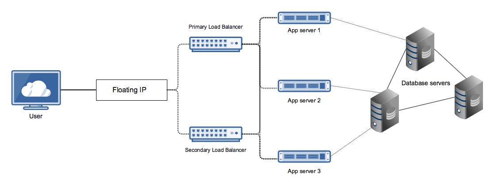
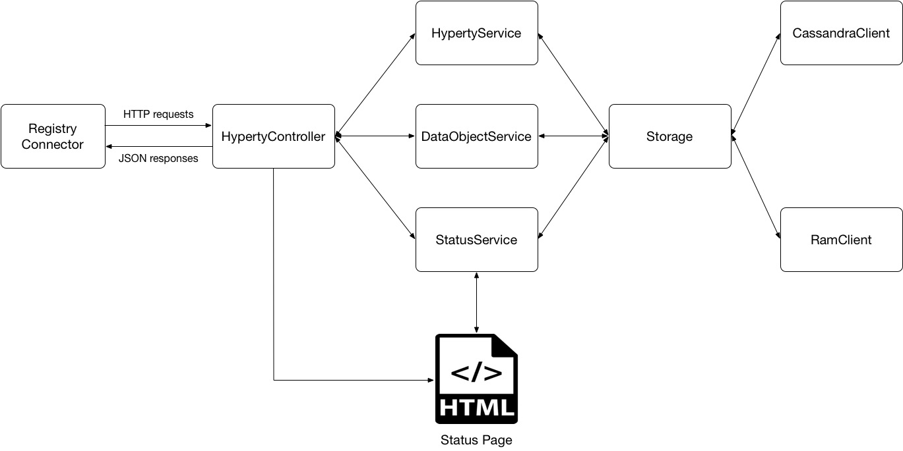
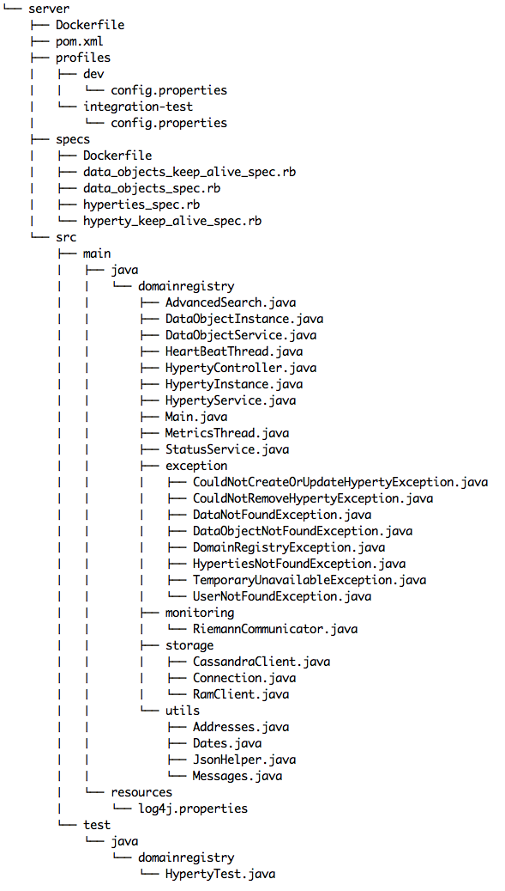

# Domain Registry Developer Manual

## Introduction 

This document describes the architecture and development choices for the a reThink’s architecture component named Domain Registry. It aims to assist developers interested in contributing or modifying this software. It may also be of use to advanced users interested in understanding the potential and limitations of this software.
This document is a companion to the Domain Registry User Manual, which should be read first, as the information provided there is not repeated here.
The remaining of this document comprises the following sections: state of the art, architecture and implementations details, and finally the code structure.

## Domain Registry Architecture

The Domain Registry is a client-server REST web server in which users may issue HTTP requests to create, update and delete Hyperty instances. REST is a software architecture style for implement networked applications, being a l​ightweight alternative to protocols such as RPC (Remote Procedure Call) and Web Services (SOAP, WSDL).

The current version of the Domain Registry supports several configuration and deployment possibilities. Check the Domain Registry user manual for more information about this.
The architecture is shown in Figure 1. Documentation on how to use two load balancer in a failover mode is yet to be documented.

 **Figure 1:** Domain Registry architecture 

## Implementation and design choices

The developed REST server features [Spark Java](http://sparkjava.com), which is a Java framework for building web applications. Furthermore, the API is being tested with an API testing framework, written in Ruby, called [Airborne](https://github.com/brooklynDev/airborne). Comparing Airborne with other API testing frameworks, this one leverages the use of the Ruby programming language, which has a m​ore flexible and terser syntax than other frameworks written in another programming languages, such as Java’s [Rest-assured](https://github.com/jayway/rest-assured).

[Apache Maven](https://maven.apache.org) is used as a build automation and management tool. It provides a
new concept of a project object model (POM) file to manage the project’s build, dependencies and documentation. A major advantage of using this tool is its feature to download all project dependencies automatically.

Besides Maven, Docker is used both for development and deployment.
Docker, sometimes described as lightweight Virtual Machines, is a new container technology, that eases the process of packaging and shipping distributed applications, whether on personal computers, VMs, or the cloud.
It allows applications to be isolated within containers with instructions for what they will need to be ported from machine to machine.
VMs allow exactly the same thing and with configuration management tools, such as Puppet, Chef or event Vagrant, the process of configuring portable and reproducible applications becomes less complicated.
However, where Docker stands out is on resource efficiency.
If we have fifteen Docker containers we can run all fifteen with a single command on a single VM.
By contrast, if we have fifteen VMs, we need to boot fifteen operative systems instances with a minimum of resources from the base OS.
Besides the clearly outstanding performance of Docker, what really made us use it was its painless way of deploying applications.
Docker containers are created using images.
These images can be very basic (containing nothing but the OS fundamentals), or it can comprise sophisticated pre-built applications ready to use.
Applications are run through Dockerfiles that contain various instructions to automatically perform actions on a base image.
After writing the necessary Dockerfiles, with only two commands, i.e., docker build and docker run, the
application is launched and is ready to be used.

Regarding the structure of the code, a MVC inspired approach was used to make a clear division between modules (separation of concerns), and therefore easily test them individually. The organization of code within this MVC based structure provides a clean and organized codebase, making it easier to scale in terms of functionality. From a development standpoint it also provides easy integration with other frameworks and backend services (e.g. databases).

In the Domain Registry’s code, the _HypertyController_, _HypertyService_ and _DataObjectService_ classes provide all the functionality of the server. The first, the controller, is the link between the user and the system. It interprets user's HTTP requests and passes them to the second class, the service. This class handles the data and responds back to the controller with a response, which will be sent to the user in a JSON format. A collaboration between the components can be seen in Figure 2.

The _HypertyService_ and _DataObjectService_ classes (the “M” in “MVC”) provide methods to create (or update) and return Hyperties and DataObjects that are being stored in a in-memory data structure (Hashtable) or in a Database, such as Cassandra DB. Currently, both these storage models (in-memory vs Cassandra DB) are supported.

The StatusService class is used to generate data to be presented into the /live page.

 **Figure 2:** Domain Registry inner services organization

The way code is organized in the Github repository is shown in the Following figure.

 **Figure 3:** Domain Registry code structure

Each folder contains the following:

* src/main/java -> Application/Library sources;
* src/main/resources -> Application/Library resources (such as [log4j](http://logging.apache.org/log4j/2.x)
properties files);
* src/test/java -> Test sources
* src/test/resources -> Test resources
* profiles -> set of configuration values which can be used to override maven’s
default configuration build. Using build profiles, it is possible to customize
builds for different environments (production/development);
* pom.xml file -> XML file that contains configuration details used by maven to
build the project.
* Dockerfile -> file containing all the commands necessary to build a Domain Registry Docker container image.

