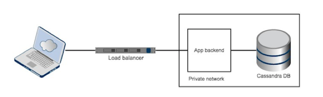
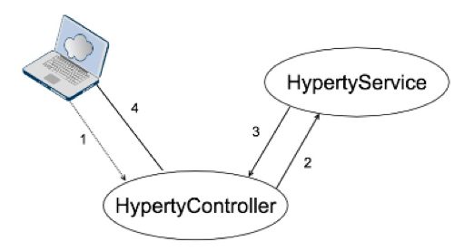
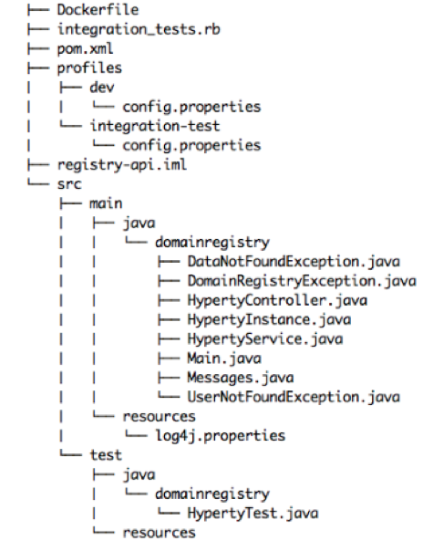

# Domain Registry Developer Manual

## Introduction 

This document describes the architecture and development choices for the a reThink’s architecture component named Domain Registry. It aims to assist developers interested in contributing or modifying this software. It may also be of use to advanced users interested in understanding the potential and limitations of this software.
This document is a companion to the Domain Registry User Manual, which should be read first, as the information provided there is not repeated here.
The remaining of this document comprises the following sections: state of the art, architecture and implementations details, and finally the code structure.

## Domain Registry Architecture

The Domain Registry is a client-server REST web server in which users may issue HTTP requests to create, update and delete Hyperty instances. REST is a software architecture style for implement networked applications, being a l​ightweight alternative to protocols such as RPC (Remote Procedure Call) and Web Services (SOAP, WSDL).

The already developed initial prototype stores data in memory. As the prototype will evolve, a database will be required. The NoSQL database Cassandra was the elected database to backend Domain Registry’s next prototype version. Also, a load balancer will be added to distribute the workload a​cross multiple servers. The architecture is shown in Figure 1.

 **Figure 1:** Domain Registry architecture 

## Implementation and design choices

The developed REST server features [Spark Java](http://sparkjava.com), which is a Java framework for building web applications. Furthermore, the API is being tested with an API testing framework, written in Ruby, called [Airborne](https://github.com/brooklynDev/airborne). Comparing Airborne with other API testing frameworks, this one leverages the use of the Ruby programming language, which has a m​ore flexible and terser syntax than other frameworks written in another programming languages, such as Java’s [Rest-assured](https://github.com/jayway/rest-assured). Regarding unit testing, Junit is being used to test individual modules of source code.

[Apache Maven](https://maven.apache.org) is used as a build automation and management tool. It provides a
new concept of a project object model (POM) file to manage the project’s build, dependencies and documentation. A major advantage of using this tool is its feature to download all project dependencies automatically.

Regarding the structure of the code, a MVC inspired approach was used to make a clear division between modules (separation of concerns), and therefore easily test them individually. The organization of code within this MVC based structure provides a clean and organized codebase, making it easier to scale in terms of functionality. From a development standpoint it also provides easy integration with other frameworks and backend services (e.g. databases).

In the Domain Registry’s code, the _HypertyController_ and _HypertyService_ classes provide all the functionality of the server. The first, the controller, is the link between the user and the system. It interprets user's HTTP requests and passes them to the second class, the service. This class handles the data and responds back to the controller with a response, which will be sent to the user in a JSON format. A collaboration between the components can be seen in Figure 2.

The _HypertyService_ class (the “M” in “MVC”) provides three methods: _getAllHyperties()_, _createUserHyperty()_ and _deleteUserHyperty()_. Theses methods create (or update), delete and return all hyperties that are being stored in a in-memory data structure called Hashtable. Future work includes using a database to ensure data persistence. However, for the time being data will continue to be stored in-memory.

Another important feature that the _HypertyService_ class provides is the association between the creation and update time of a Hyperty with the response sent back to the user. Every time a user requests all the Hyperties from another user, these two additional fields are added, representing the freshness of the Hyperties.

The way code is organized in the Github repository is shown in Figure 3.

 

**Figure 2:** Domain Registry architecture pattern
 

**Figure 3:** Domain Registry directory structure

Each folder contains the following:

* src/main/java -> Application/Library sources;
* src/main/resources -> Application/Library resources (such as [log4j](http://logging.apache.org/log4j/2.x)
properties files);
* src/test/java -> Test sources
* src/test/resources -> Test resources
* profiles -> set of configuration values which can be used to override maven’s
default configuration build. Using build profiles, it is possible to customize
builds for different environments (production/development);
* pom.xml file -> XML file that contains configuration details used by maven to
build the project.
* Dockerfile -> file containing all the commands necessary to build a Domain Registry Docker container image.

