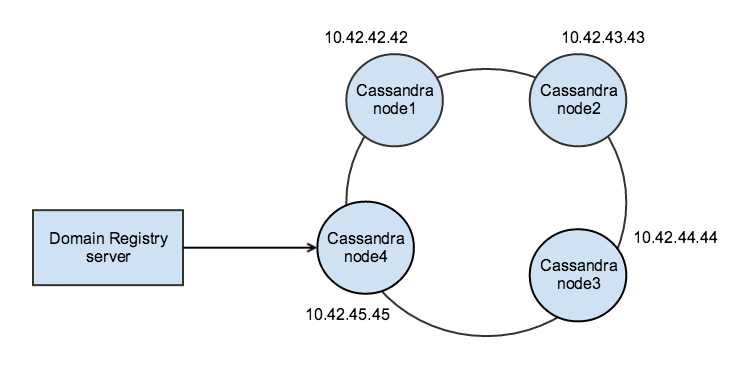

# Domain Registry User Manual

## Introduction

This document provides instructions on the use of a reThink’s architecture component named Domain Registry. Together with the Global Registry, it forms the Registry Service. The Global Registry provides a mapping from a User’s Unique Id (GUID) to the several services it uses. Each Communication Service Provider (CSP)
runs a Domain Registry service that resolves domain-dependent user identifiers to
the actual information about this user’s Hyperty Instances (a Hyperty used by a user in one device).

A Domain Registry stores, for each user identifier, the list of Hyperty Instances the user runs on his devices. It also stores, for each Hyperty Instance, the data that enables other applications to contact it, by providing a mapping between the identifier for each Hyperty Instance and the data that characterizes it.

The Domain Registry is a critical service as it stands in the critical path for call establishment. As it will be used very often, it must provide a low access time, high availability and be capable of fast updates (e.g. for when a device changes IP address). It is based on the client-server model and handles high-speed and high- frequency data.

The remaining of this document comprises the following sections: How to deploy, comprising instructions on how to use Docker and
the command line, a definition of the REST API and respective available endpoints, and finally, some usage examples.

## How to deploy

The Domain Registry is deployed using Docker. All commands must be executed  inside the _server_ folder.

### How to deploy using docker

A Dockerfile is provided, so it is possible to run the Domain Registry through a Docker container. Since several ways of storing requests are available, there are three possible ways to run the Domain Registry.

1. Storing requests in-memory;
2. Storing requests in a multi-host Cassandra database cluster.
3. Storing requests in a single Cassandra node;

#### Requests saved in-memory

Requests may be saved in-memory. It is the simplest way to deploy the server. However, when the server is shutdown, all information stored there is lost. The commands are the following:

```
$ docker build -t domain-registry .
$ docker run -e STORAGE_TYPE=RAM -e EXPIRES=3600 -p 4568:4567 domain-registry
```
Expires global variable defines the maximum amount of time (in seconds) a Hyperty stays in the server (see [soft state issue](https://github.com/reTHINK-project/dev-registry-domain/issues/7)). Note that the published port 4568 may be changed to another port that better suits your needs. Running the server with this configuration will work exactly as the last version (R0.1.0).

#### Requests saved in a multi-host Cassandra cluster

The Domain Registry database can be stored in a persistante maner using the Casandra noSQL database. A cluster of Cassandra nodes can be used to ensure resilience to node failure (high-availability) and load-balancing of the database.

The following diagram show what will be achieved by doing this section of the tutorial. A four node Cassandra cluster will be deployed, the Domain Registry data model will be issued to the cluster and finally the Domain Registry application server will be started and linked to the cluster. Along the way, some pictures will be provided to ensure that everything is working as expected.



Starting the database cluster in separate machines (ie, two VMs on a cloud service provider), requires that every Cassandra node advertises an IP address to the other nodes because the address of the container is behind the docker bridge. The environment variable CASSANDRA\_BROADCAST\_ADDRESS serves that purpose.

The first thing to do when initializing the cluster is setting up some seeds nodes. Theses nodes are responsible for advertising the cluster when new nodes are joining. Without at least one live seed node, no new nodes can join the cluster because they have no idea how to contact non-seed nodes. In the following example we will use two seed nodes in a four node cluster. Assuming that the first machine`s IP is 10.42.42.42, the second 10.42.43.43, the third 10.42.44.44 and the fourth 10.42.45.45, execute the next commands.

* Seed nodes initialization

```
$ docker run -d -e CASSANDRA_BROADCAST_ADDRESS=10.42.42.42 -e CASSANDRA_ENDPOINT_SNITCH='GossipingPropertyFileSnitch' -p 9042:9042 -p 7000:7000 cassandra:latest
$ docker run -d -e CASSANDRA_BROADCAST_ADDRESS=10.42.43.43 -e CASSANDRA_ENDPOINT_SNITCH='GossipingPropertyFileSnitch' -p 9042:9042 -p 7000:7000 cassandra:latest
```

* Non-seed nodes initialization. Start these nodes with a two minute delay between them (Cassandra requirement)

```
$ docker run -d -e CASSANDRA_BROADCAST_ADDRESS=10.42.44.44 -p 7000:7000 -e CASSANDRA_SEEDS=10.42.42.42,10.42.43.43 -e CASSANDRA_ENDPOINT_SNITCH='GossipingPropertyFileSnitch' -p 9042:9042 cassandra:latest
$ docker run -d -e CASSANDRA_BROADCAST_ADDRESS=10.42.45.45 -p 7000:7000 -e CASSANDRA_SEEDS=10.42.42.42,10.42.43.43 -e CASSANDRA_ENDPOINT_SNITCH='GossipingPropertyFileSnitch' -p 9042:9042 cassandra:latest
```

Log onto one of the servers and follow the remaining of this manual. Before running the next command, execute _docker ps_ to ensure that the container is indeed running.

* Connect to the cluster using cqlsh (Cassandra query language interactive terminal).

```
$ docker run -it --link <container name>:cassandra --rm cassandra sh -c 'exec cqlsh "$CASSANDRA_PORT_9042_TCP_ADDR"'
```
You should see something like:

```
[cqlsh 5.0.1 | Cassandra 2.2.0 | CQL spec 3.3.0 | Native protocol v4]
Use HELP for help.
cqlsh>
```

* Execute Domain registry data model configuration in cqlsh

Paste the following configuration into your cqlsh prompt to create a keyspace, and two hyperties's tables:

```
CREATE KEYSPACE rethinkeyspace WITH replication = {'class':'SimpleStrategy', 'replication_factor' : 4};

use rethinkeyspace;

CREATE TABLE guid_by_user_id (
    user text,
    guid text,
    PRIMARY KEY(guid)
);

CREATE TABLE hyperties_by_id (
    hypertyid text,
    user text,
    descriptor text,
    startingTime text,
    guid text,
    status text,
    lastModified text,
    expires int,
    runtime text,
    p2pRequester text,
    p2pHandler text,
    resources list<text>,
    dataSchemes list<text>,
    PRIMARY KEY(hypertyid)
);

CREATE TABLE data_objects_by_url (
    name text,
    schem text,
    startingTime text,
    lastModified text,
    status text,
    runtime text,
    p2pRequester text,
    expires int,
    reporter text,
    url text,
    resources list<text>,
    dataSchemes list<text>,
    PRIMARY KEY(url)
);

CREATE TABLE data_objects_by_reporter (
    name text,
    schem text,
    status text,
    expires int,
    runtime text,
    p2pRequester text,
    startingTime text,
    lastModified text,
    reporter text,
    url text,
    resources list<text>,
    dataSchemes list<text>,
    PRIMARY KEY(reporter, url)
);

CREATE TABLE data_objects_by_name (
    name text,
    schem text,
    status text,
    expires int,
    startingTime text,
    lastModified text,
    runtime text,
    p2pRequester text,
    reporter text,
    url text,
    resources list<text>,
    dataSchemes list<text>,
    PRIMARY KEY(name, url)
);

CREATE TABLE hyperties_by_user (
    hypertyid text,
    user text,
    descriptor text,
    guid text,
    status text,
    runtime text,
    p2pRequester text,
    p2pHandler text,
    startingTime text,
    lastModified text,
    expires int,
    resources list<text>,
    dataSchemes list<text>,
    PRIMARY KEY(user, hypertyid)
);

SELECT * FROM hyperties_by_id;
```
An empty hyperties table should appear. You may change the replication\_factor to another value. With this configuration (4 nodes with a replication factor of 3), we can tolerate the loss of 2 nodes. 

The following command provides information about the cluster, such as the state (Normal/Leaving/Joining/Moving), load, and IDs.

```
$ docker exec <container-name> nodetool status rethinkeyspace
```
Observe that "rethinkeyspace" is the name of the keyspace defined previously.

Something like this should appear:

```
Datacenter: datacenter1

Status=Up/Down
|/ State=Normal/Leaving/Joining/Moving
--  Address       Load       Tokens       Owns (effective)  Host ID                               Rack
UN  10.42.42.42   167.54 KB  256          75.0%             04111fc6-4dfa-496c-b904-0defde6d3b92  rack1
UN  10.42.43.43   298.41 KB  256          75.4%             b5b98cd9-dea0-4413-9387-1050dd3dafc3  rack1
UN  10.42.44.44   270.25 KB  256          75.0%             f771448e-2a93-4726-af0a-21d1577ca3d9  rack1
UN  10.42.45.45   258.53 KB  256          75.0%             4e6a07c9-dd3b-43e2-9cc0-32e39122a82d  rack1
```

With the database cluster running we can start the Domain Registry with the following commands:

```
$ docker build -t domain-registry .
$ docker run -e STORAGE_TYPE=CASSANDRA -e CONTACT_POINTS_IPS=IP1,...,IPn -e EXPIRES=3600 -p 4568:4567 domain-registry
```
The environment variable CONTACT\_POINTS\_IPS comprises a set of IP addresses belonging to some database nodes. The Domain Registry server will use these IP's to discover and establish a connection with the database. The server will only use one IP, but providing the client with more IPs will increase the chance for the client to continue to work with the database in case of node failures.

When executing the _docker run_ command, if something like this appear, it means that the client successfully connected with the database cluster.

```
Connected to cluster: Test Cluster
Datacenter: datacenter1; Host: /10.42.42.42; Rack: rack1
Datacenter: datacenter1; Host: /10.42.43.43; Rack: rack1
Datacenter: datacenter1; Host: /10.42.44.44; Rack: rack1
Datacenter: datacenter1; Host: /10.42.45.45; Rack: rack1
```

Finally, the /live page could be used to verify up and down Cassandra nodes. A GET /live should return the following JSON object:

```
{
  "Database cluster size": "5",
  "Hyperties stored": "0",
  "Database up nodes": "5",
  "Database connection": "up",
  "Storage type": "Cassandra",
  "status": "up"
}
```
More details about Cassandra and how to deploy a cluster can be found on [Cassandra's offical website](http://cassandra.apache.org) and [Cassandra's docker hub repository](https://hub.docker.com/_/cassandra/).
#### Storing requests in a single Cassandra node

A single Cassandra node may be used to provide persistante information storage. However, with a single node, no redundancy is provided. Starting the Domain Registry backed with a single database node is quite simple:

```
$ docker run --name cassandra-node -d cassandra:latest
```

Next, follow the same steps as before. Establish a connection to the cluster with cqlsh, execute the data model into the cqlsh prompt, verify that everything is working as expected, and finally start the Domain Registry.

```
$ docker build -t domain-registry .
$ docker run -e STORAGE_TYPE=CASSANDRA -e CONTACT_POINTS_IPS=ip -e EXPIRES=3600 -p 4568:4567 domain-registry
```

## High availability deployment

The previously tutorial assumuded that only one Domain Registry application server was running.
Although, in order to increase both capacity (concurrent users) and application’s reliability, a Load Balancer can be added to distribute network traffic across several Domain Registry servers.
Moreover, load balancers offer content-aware distribution, redundancy and health checking to ensure that the servers are indeed running and accepting requests.
If a server is found to be down, the load balancer removes it from rotation and stops sending it requests.

This process of load balancing Internet traffic is entirely related to scalability.
As servers become overloaded, system administrators are generally faced with two possibilities: vertically or horizontal scalability.
The first is performed by adding more resources to a single server, typically by adding more RAM or CPUs.
However, a single server could only scale so far.
At some point, it is impossible to add more resources since the hardware platform has its limits.
Also, the server needs to be taken down in order for this upgrade to be concluded.
On the other hand, horizontal scalability is the ability to add more nodes to the system.
This usually requires one of several load balancing techniques, topic that will be explored further on - but first, DNS-based load balancing will be summarized since it is also a process to distribute traffic across multiple servers.

DNS-based load balancing, also known as DNS round robin, is a function of DNS that allows one hostname to be associated with one or more IP addresses.
Although very easy to deploy, round robin DNS has a few drawbacks, such as if a server corresponding to one of the IP addresses is down, DNS will continue to deliver that IP address and clients will attempt to connect to a service that has failed.

Load balancing can be accomplished at various layers of OSI. Here we make an overview of the two most used load balancing options: layer 4 and layer 7 load balancing.

1) Layer 4 load balancing operates at the transport layer, which redirects requests no matter the type of the request or its contents.
It is simplest method of balancing traffic across servers.
This simplicity means fastness balancing with minimal hardware.
However, limitations are present.
Since the load balancer can not see the contents of the request, it can not make routing decisions based on that.
That is, it can not decide what is the best server to deal with a specific request.

2) Layer 7 load balancing operates at a high level application layer, which deals, and can make decisions based on the actual content of each message.
This kind of load balancers differ form layer 4 load balancers because the servers do not need to serve the exact same content.
Instead, each of the servers can specifically and efficiently serve specific content such as, video or images.
So now a request for an image or video can be routed to specific servers that store and are optimized to serve multimedia content.

## Rest API definition and available endpoints

The Domain Registry is a REST server that allows to create, update and remove data (Hyperty Instances and Data Objects). Next, are described, the available Data Objects and Hyperties API endpoints.

Hyperties:

* GET /hyperty/user/:user_id
* GET /hyperty/user/:user_id/hyperty?resources=R1,...,Rn&dataSchemes=DS1,...,DSn
* GET /hyperty/user/:user_id/hyperty?dataSchemes=DS1,...,DSn
* GET /hyperty/user/:user_id/hyperty?resources=R1,...,Rn
* PUT /hyperty/user/:user_id/:hyperty_instance_id

Data Objects:

* GET /hyperty/dataobject/name/:data_object_name
* GET /hyperty/dataobject/url/:data_object_url
* GET /hyperty/dataobject/reporter/:reporter
* GET /hyperty/dataobject/reporter/:reporter/do?resources=R1,...,Rn&dataSchemes=DS1,...,DSn
* GET /hyperty/dataobject/reporter/:reporter/do?dataSchemes=DS1,...,DSn
* GET /hyperty/dataobject/reporter/:reporter/do?resources=R1,...,Rn
* GET /hyperty/dataobject/name/:data_object_name/do?resources=R1,...,Rn&dataSchemes=DS1,...,DSn
* GET /hyperty/dataobject/name/:data_object_name/do?dataSchemes=DS1,...,DSn
* GET /hyperty/dataobject/name/:data_object_name/do?resources=R1,...,Rn
* GET /hyperty/dataobject/url/:data_object_url/do?resources=R1,...,Rn&dataSchemes=DS1,...,DSn
* GET /hyperty/dataobject/url/:data_object_url/do?dataSchemes=DS1,...,DSn
* GET /hyperty/dataobject/url/:data_object_url/do?resources=R1,...,Rn
* PUT /hyperty/dataobject/:data_object_url


Possible HTTP status codes returned: 200 OK indicating that the request has succeeded and 404 Not Found indicating that the server has not found anything matching the request URI (data objects or hyperties). In both cases, a message is returned on the response: “hyperty created”, “data object created” or “not found”.

Since the users and hyperties URLs contain characters outside the ASCII set, URLs need to be converted to a valid ASCII format. The character “%” followed by two
hexadecimal digits replace the unsafe characters. As an example, the enconded
version of user://inesc-id.pt/ruijose is user%3A%2F%2Finesc-id.pt%2Fruijose.

### GET /hyperty/user/:user_id

Retrieves all Hyperties instances from a user indicated by the user_id parameter.

#### Parameters

**user_id**: The owner of the Hyperty.

**Example_value**: user://inesc-id.pt/ruijose

#### Example request

GET /hyperty/user/user%3A%2F%2Finesc-id.pt%2Fruijose

#### Example result

```
{
  "hyperty://inesc-id.pt/b7b3rs4-3245-42gn-4127-238jhdq83d8": {
    "resources" : [
      "video",
    ],
    "dataSchemes" : [
      "comm"
    ]
    "descriptor": "hyperty-catalogue://localhost/HelloHyperty",
    "startingTime": "2016-02-08T13:42:00Z",
    "hypertyID": "hyperty://localhost/075932a5-7ef3-40dd-bcc4-34094ab907e7",
    "userID": "user://inesc-id.pt/rui",
    "lastModified": "2016-02-08T13:42:53Z",
    "status": "live",
    "expires": 1211,
    "guid": "guid",
    "runtime": "runtime",
    "p2pRequester": "p2pRequester",
    "p2pHandler": "p2pHandler"
  },

  "hyperty://inesc-id.pt/b7b123123213rs4-3245-42gn-4127-238jhdq83d8": {
    "resources" : [
      "video",
    ],
    "dataSchemes" : [
      "comm"
    ]
    "descriptor": "hyperty-catalogue://localhost/HelloHyperty",
    "startingTime": "2015-02-08T13:42:00Z",
    "hypertyID": "hyperty://localhost/075932a5-7ef3-40dd-bcc4-34094ab907e7",
    "userID": "user://inesc-id.pt/nuno",
    "lastModified": "2017-02-08T13:42:53Z",
    "status": "live",
    "expires": 50,
    "guid": "guid",
    "runtime": "runtime",
    "p2pRequester": "p2pRequester",
    "p2pHandler": "p2pHandler"
  }
}
```

The descriptor is a link to the Catalogue from where the descriptor of the instance can be retrieved and, the startingTime and lastModified refer to the date the instance is first registered and the last time the instance was modified. Both dates format are compliant with ISO8601 format. In the future, more information about the hyperty instances will be provided.

In this example, two hyperty instances are returned for the requested user id. Note that the requested URLs are encoded.

If the server could not find what was requested, along with the HTTP status codes, a “not found” message is returned to the client.

#### Error messages Examples

```
{
  “message” : “not found”
}
```

### GET /hyperty/user/:user_id/hyperty?resources=R1,...,Rn&dataSchemes=DS1,...,DSn

Returns Hyperties which possess the specified resources, data schemes and user identifier.

#### Parameters

**user_id**: The owner of the Hyperties.

**resources**: Hyperty resource types (e.g. voice, video).

**data schemes**: Data objects schemes.

#### Example request

GET /hyperty/user/user%3A%2F%2Finesc-id.pt%2Fruijose/hyperty?resources=chat,voice&dataSchemes=comm

#### Example response

Same as above.

### PUT /hyperty/user/:user_id/:hyperty_instance_id

Creates or updates a Hyperty Instance. It also creates a user if it doesn’t exists already.

#### Parameters

**user_id**: The owner of the Hyperty.

**Example_value**: user://inesc-id.pt/ruijose

**hyperty_id**: The ID of the Hyperty to be created.

**Example_value**: hyperty://ua.pt/428bee1b-887a8ee8cb32

#### Example request

PUT /hyperty/user/user%3A%2F%2Finesc-id.pt%2Fruijose/hyperty%3A%2F%2Fua.pt%2F428bee1b-887a8ee8cb32

```
{
    "resources" : ["chat", "voice"],
    "dataSchemes" : ["comm"],
    "descriptor": "hyperty-catalogue://localhost/HelloHyperty",
    "expires" : 3600,
    "status": "live",
    "runtime": "runtime",
    "p2pRequester": "p2pRequester",
    "p2pHandler": "p2phandler",
    "guid": "guid"
}
```

#### Example result

```
{
  “message” : “hyperty created”
}
```

Note that the requested URL’s are encoded.

### GET /hyperty/dataobject/name/:data_object_name

#### Example request

GET /hyperty/dataobject/name/mychat

#### Example result

```
{
  "comm://hybroker.rethink.ptinovacao.pt/aa2f5bec-e3f7-471f-8ace-44c64edb8a6d": {
    "schema": "hyperty-catalogue://catalogue.hybroker.rethink.ptinovacao.pt/.well-known/dataschema/Communication",
    "url": "comm://hybroker.rethink.ptinovacao.pt/aa2f5bec-e3f7-471f-8ace-44c64edb8a6d",
    "reporter": "hyperty://hybroker.rethink.ptinovacao.pt/24a0724a-68ff-4f0d-ba2b-1e71911a7213",
    "name": "mychat",
    "status": "live",
    "expires" : 120,
    "startingTime": "2016-07-26T12:54:37Z",
    "resources": [
      "chat"
    ],
    "dataSchemes": [
      "comm"
    ],
    "lastModified": "2016-07-26T13:03:58Z"
  }
}
```
### GET /hyperty/dataobject/url/:data_object_url

#### Example request

GET /hyperty/dataobject/url/comm%3A%2F%2Fhybroker.rethink.ptinovacao.pt%2Faa2f5bec-e3f7-471f-8ace-44c64edb8a6d

#### Example result

```
{
  "comm://hybroker.rethink.ptinovacao.pt/aa2f5bec-e3f7-471f-8ace-44c64edb8a6d": {
    "schema": "hyperty-catalogue://catalogue.hybroker.rethink.ptinovacao.pt/.well-known/dataschema/Communication",
    "url": "comm://hybroker.rethink.ptinovacao.pt/aa2f5bec-e3f7-471f-8ace-44c64edb8a6d",
    "reporter": "hyperty://hybroker.rethink.ptinovacao.pt/24a0724a-68ff-4f0d-ba2b-1e71911a7213",
    "name": "mychat",
    "expires" : 120,
    "status": "live",
    "startingTime": "2016-07-26T12:54:37Z",
    "resources": [
      "chat"
    ],
    "dataSchemes": [
      "comm"
    ],
    "lastModified": "2016-07-26T13:03:58Z"
  }
}
```

### GET /hyperty/dataobject/reporter/:reporter

#### Example request

GET /hyperty/dataobject/reporter/hyperty%3A%2F%2Fhybroker.rethink.ptinovacao.pt%2F24a0724a-68ff-4f0d-ba2b-1e71911a7213

#### Example result

```
{
  "comm://hybroker.rethink.ptinovacao.pt/aa2f5bec-e3f7-471f-8ace-44c64edb8a6d": {
    "schema": "hyperty-catalogue://catalogue.hybroker.rethink.ptinovacao.pt/.well-known/dataschema/Communication",
    "url": "comm://hybroker.rethink.ptinovacao.pt/aa2f5bec-e3f7-471f-8ace-44c64edb8a6d",
    "reporter": "hyperty://hybroker.rethink.ptinovacao.pt/24a0724a-68ff-4f0d-ba2b-1e71911a7213",
    "name": "mychat",
    "status": "live",
    "expires" : 120,
    "startingTime": "2016-07-26T12:54:37Z",
    "resources": [
      "chat"
    ],
    "dataSchemes": [
      "comm"
    ],
    "lastModified": "2016-07-26T13:03:58Z"
  }
}
```

### GET /hyperty/dataobject/reporter/:reporter/do?resources=R1,...,Rn&dataSchemes=DS1,...,DSn

#### Example request

GET /hyperty/dataobject/reporter/hyperty%3A%2F%2Fhybroker.rethink.ptinovacao.pt%2F24a0724a-68ff-4f0d-ba2b-1e71911a7213/do?resources=chat&dataSchemes=comm

#### Example result

```
{
  "comm://hybroker.rethink.ptinovacao.pt/aa2f5bec-e3f7-471f-8ace-44c64edb8a6d": {
    "schema": "hyperty-catalogue://catalogue.hybroker.rethink.ptinovacao.pt/.well-known/dataschema/Communication",
    "url": "comm://hybroker.rethink.ptinovacao.pt/aa2f5bec-e3f7-471f-8ace-44c64edb8a6d",
    "reporter": "hyperty://hybroker.rethink.ptinovacao.pt/24a0724a-68ff-4f0d-ba2b-1e71911a7213",
    "name": "mychat",
    "status": "live",
    "expires" : 120,
    "startingTime": "2016-07-26T12:54:37Z",
    "resources": [
      "chat"
    ],
    "dataSchemes": [
      "comm"
    ],
    "lastModified": "2016-07-26T13:03:58Z"
  }
}

```

### GET /hyperty/dataobject/reporter/:reporter/do?resources=R1,...,Rn

#### Example request

GET /hyperty/dataobject/reporter/hyperty%3A%2F%2Fhybroker.rethink.ptinovacao.pt%2F24a0724a-68ff-4f0d-ba2b-1e71911a7213/do?resources=chat

#### Example result

```
{
  "comm://hybroker.rethink.ptinovacao.pt/aa2f5bec-e3f7-471f-8ace-44c64edb8a6d": {
    "schema": "hyperty-catalogue://catalogue.hybroker.rethink.ptinovacao.pt/.well-known/dataschema/Communication",
    "url": "comm://hybroker.rethink.ptinovacao.pt/aa2f5bec-e3f7-471f-8ace-44c64edb8a6d",
    "reporter": "hyperty://hybroker.rethink.ptinovacao.pt/24a0724a-68ff-4f0d-ba2b-1e71911a7213",
    "name": "mychat",
    "status": "live",
    "expires" : 120,
    "startingTime": "2016-07-26T12:54:37Z",
    "resources": [
      "chat"
    ],
    "dataSchemes": [
      "comm"
    ],
    "lastModified": "2016-07-26T13:03:58Z"
  }
}

```

### GET /hyperty/dataobject/reporter/:reporter/do?dataSchemes=DS1,...,DSn

#### Example request

GET /hyperty/dataobject/reporter/hyperty%3A%2F%2Fhybroker.rethink.ptinovacao.pt%2F24a0724a-68ff-4f0d-ba2b-1e71911a7213/do?dataSchemes=comm

#### Example result

```
{
  "comm://hybroker.rethink.ptinovacao.pt/aa2f5bec-e3f7-471f-8ace-44c64edb8a6d": {
    "schema": "hyperty-catalogue://catalogue.hybroker.rethink.ptinovacao.pt/.well-known/dataschema/Communication",
    "url": "comm://hybroker.rethink.ptinovacao.pt/aa2f5bec-e3f7-471f-8ace-44c64edb8a6d",
    "reporter": "hyperty://hybroker.rethink.ptinovacao.pt/24a0724a-68ff-4f0d-ba2b-1e71911a7213",
    "name": "mychat",
    "status": "live",
    "expires" : 120,
    "startingTime": "2016-07-26T12:54:37Z",
    "resources": [
      "chat"
    ],
    "dataSchemes": [
      "comm"
    ],
    "lastModified": "2016-07-26T13:03:58Z"
  }
}

```

### GET /hyperty/dataobject/name/:data_object_name/do?resources=R1,...,Rn&dataSchemes=DS1,...,DSn

#### Example request

GET /hyperty/dataobject/name/mychat/do?resources=chat&dataSchemes=comm

#### Example result

```
{
  "comm://hybroker.rethink.ptinovacao.pt/aa2f5bec-e3f7-471f-8ace-44c64edb8a6d": {
    "schema": "hyperty-catalogue://catalogue.hybroker.rethink.ptinovacao.pt/.well-known/dataschema/Communication",
    "url": "comm://hybroker.rethink.ptinovacao.pt/aa2f5bec-e3f7-471f-8ace-44c64edb8a6d",
    "reporter": "hyperty://hybroker.rethink.ptinovacao.pt/24a0724a-68ff-4f0d-ba2b-1e71911a7213",
    "name": "mychat",
    "status": "live",
    "expires" : 120,
    "startingTime": "2016-07-26T12:54:37Z",
    "resources": [
      "chat"
    ],
    "dataSchemes": [
      "comm"
    ],
    "lastModified": "2016-07-26T13:03:58Z"
  }
}

```
### GET /hyperty/dataobject/name/:data_object_name/do?resources=R1,...,Rn

#### Example request

GET /hyperty/dataobject/name/mychat/do?resources=chat

#### Example result

```
{
  "comm://hybroker.rethink.ptinovacao.pt/aa2f5bec-e3f7-471f-8ace-44c64edb8a6d": {
    "schema": "hyperty-catalogue://catalogue.hybroker.rethink.ptinovacao.pt/.well-known/dataschema/Communication",
    "url": "comm://hybroker.rethink.ptinovacao.pt/aa2f5bec-e3f7-471f-8ace-44c64edb8a6d",
    "reporter": "hyperty://hybroker.rethink.ptinovacao.pt/24a0724a-68ff-4f0d-ba2b-1e71911a7213",
    "name": "mychat",
    "status": "live",
    "expires" : 120,
    "startingTime": "2016-07-26T12:54:37Z",
    "resources": [
      "chat"
    ],
    "dataSchemes": [
      "comm"
    ],
    "lastModified": "2016-07-26T13:03:58Z"
  }
}

```

### GET /hyperty/dataobject/name/:data_object_name/do?dataSchemes=DS1,...,DSn

#### Example request

GET /hyperty/dataobject/name/mychat/do?dataSchemes=comm

#### Example result

```
{
  "comm://hybroker.rethink.ptinovacao.pt/aa2f5bec-e3f7-471f-8ace-44c64edb8a6d": {
    "schema": "hyperty-catalogue://catalogue.hybroker.rethink.ptinovacao.pt/.well-known/dataschema/Communication",
    "url": "comm://hybroker.rethink.ptinovacao.pt/aa2f5bec-e3f7-471f-8ace-44c64edb8a6d",
    "reporter": "hyperty://hybroker.rethink.ptinovacao.pt/24a0724a-68ff-4f0d-ba2b-1e71911a7213",
    "name": "mychat",
    "expires" : 120,
    "status": "live",
    "startingTime": "2016-07-26T12:54:37Z",
    "resources": [
      "chat"
    ],
    "dataSchemes": [
      "comm"
    ],
    "lastModified": "2016-07-26T13:03:58Z"
  }
}

```

### GET /hyperty/dataobject/url/:data_object_url/do?resources=R1,...,Rn&dataSchemes=DS1,...,DSn

#### Example request

GET /hyperty/dataobject/url/comm%3A%2F%2Fhybroker.rethink.ptinovacao.pt%2Faa2f5bec-e3f7-471f-8ace-44c64edb8a6d/do?resources=chat&dataSchemes=comm

#### Example result

```
{
  "comm://hybroker.rethink.ptinovacao.pt/aa2f5bec-e3f7-471f-8ace-44c64edb8a6d": {
    "schema": "hyperty-catalogue://catalogue.hybroker.rethink.ptinovacao.pt/.well-known/dataschema/Communication",
    "url": "comm://hybroker.rethink.ptinovacao.pt/aa2f5bec-e3f7-471f-8ace-44c64edb8a6d",
    "reporter": "hyperty://hybroker.rethink.ptinovacao.pt/24a0724a-68ff-4f0d-ba2b-1e71911a7213",
    "name": "mychat",
    "status": "live",
    "expires" : 120,
    "startingTime": "2016-07-26T12:54:37Z",
    "resources": [
      "chat"
    ],
    "dataSchemes": [
      "comm"
    ],
    "lastModified": "2016-07-26T13:03:58Z"
  }
}

```

### GET /hyperty/dataobject/url/:data_object_url/do?resources=R1,...,Rn

#### Example request

GET /hyperty/dataobject/url/comm%3A%2F%2Fhybroker.rethink.ptinovacao.pt%2Faa2f5bec-e3f7-471f-8ace-44c64edb8a6d/do?resources=chat

#### Example result

```
{
  "comm://hybroker.rethink.ptinovacao.pt/aa2f5bec-e3f7-471f-8ace-44c64edb8a6d": {
    "schema": "hyperty-catalogue://catalogue.hybroker.rethink.ptinovacao.pt/.well-known/dataschema/Communication",
    "url": "comm://hybroker.rethink.ptinovacao.pt/aa2f5bec-e3f7-471f-8ace-44c64edb8a6d",
    "reporter": "hyperty://hybroker.rethink.ptinovacao.pt/24a0724a-68ff-4f0d-ba2b-1e71911a7213",
    "name": "mychat",
    "status": "live",
    "expires" : 120,
    "startingTime": "2016-07-26T12:54:37Z",
    "resources": [
      "chat"
    ],
    "dataSchemes": [
      "comm"
    ],
    "lastModified": "2016-07-26T13:03:58Z"
  }
}

```

### GET /hyperty/dataobject/url/:data_object_url/do?dataSchemes=DS1,...,DSn

#### Example request

GET /hyperty/dataobject/url/comm%3A%2F%2Fhybroker.rethink.ptinovacao.pt%2Faa2f5bec-e3f7-471f-8ace-44c64edb8a6d/do?dataSchemes=comm

#### Example result

```
{
  "comm://hybroker.rethink.ptinovacao.pt/aa2f5bec-e3f7-471f-8ace-44c64edb8a6d": {
    "schema": "hyperty-catalogue://catalogue.hybroker.rethink.ptinovacao.pt/.well-known/dataschema/Communication",
    "url": "comm://hybroker.rethink.ptinovacao.pt/aa2f5bec-e3f7-471f-8ace-44c64edb8a6d",
    "reporter": "hyperty://hybroker.rethink.ptinovacao.pt/24a0724a-68ff-4f0d-ba2b-1e71911a7213",
    "name": "mychat",
    "status": "live",
    "expires" : 120,
    "startingTime": "2016-07-26T12:54:37Z",
    "resources": [
      "chat"
    ],
    "dataSchemes": [
      "comm"
    ],
    "lastModified": "2016-07-26T13:03:58Z"
  }
}

```

### PUT /hyperty/dataobject/:data_object_url

#### Example request

PUT /hyperty/dataobject/comm%3A%2F%2Fhybroker.rethink.ptinovacao.pt%2Faa2f5bec-e3f7-471f-8ace-44c64edb8a6d

```
{
  "schema" : "hyperty-catalogue://catalogue.hybroker.rethink.ptinovacao.pt/.well-known/dataschema/Communication",
  "resources" : ["chat"],
  "dataSchemes" : ["comm"],
  "name" : "myChat",
  "status" : "live",
  "expires" : 120,
  "reporter" : "hyperty://localhost/893c256e-c65c-4aaf-966c-8c89d061d6cf"
}

```

#### Example result

```
{
  "message" : "Data object created"
}

```

## Future functionalities

The current version is missing any authentication mechanisms. Currently, it is assumed that the Message Node is the only one capable of interacting with the Local Registry, with the former being trusted by the latter to verify the user’s authorization to perform the requests. This model will have to be replaced with a secure mechanism where either the identity of the Message Node or of the user is verified.

A load balancer will also be added to distribute network traffic across the Domain Registry servers. Thereby, we hope to increase capacity (concurrent users) and application’s reliability.
