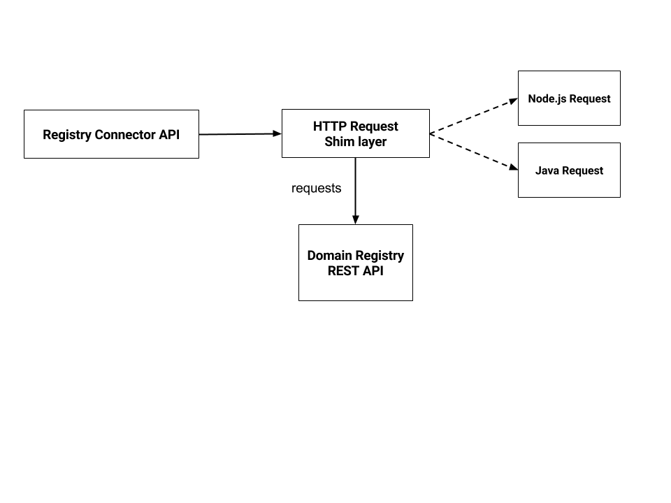
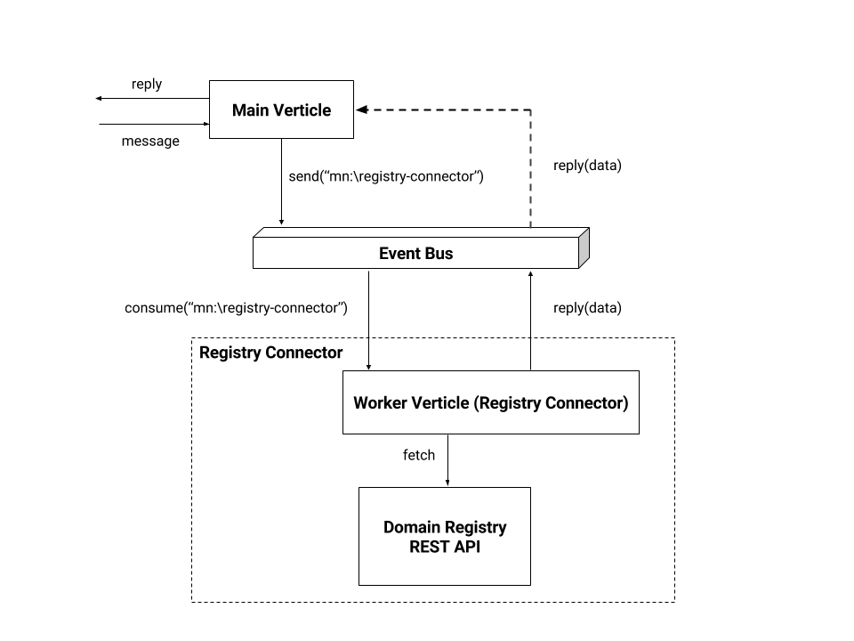
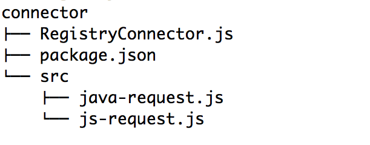

# Registry Connector Manual

## Introduction

### Motivation
This document describes the manual for the reThink architecture component named
Registry Connector. The Registry Connector is the component that ensures the
communication between the Messaging Node and the Domain Registry.

### Context
One of the components of the reThink project architecture is the Registry
service.  The Registry service is similar to a directory service, that
facilitates management and lookup of the Hyperty instances being run on users’
devices.  The Registry service is sub-divided in two components: the Global
Registry, built on top of a Distributed Hash Table, and the Domain Registry,
which uses the client-server model and provides a REST API.  The Registry
service must be a replicated, load balanced, fault tolerant distributed system
with worldwide availability.  The communication between the user's device
runtime and the Domain Registry, is done through the Messaging Node. Therefore
a component named Registry Connector is required to bridge the Messaging Node
and the Domain Registry. This component, the Registry Connector, run on the
Messaging Node, being responsible for the communication with the REST API
provided by the [Domain
Registry](https://github.com/reTHINK-project/dev-registry-domain/blob/master/docs/DomainRegistryDeveloperManual.md).

### Functionalities
The Registry Connector is implemented in Javascript so it is possible to reuse
the component in the several Messaging Node implementations: it could be used
in the [Matrix](http://matrix.org/), [Node.js](https://nodejs.org) and
[Vert.x](http://vertx.io/) (Java Virtual Machine) implementations.  The
Registry Connector implements the CRUD operations (Create, Read, Update and
Delete) provided by the Domain Registry REST API.

### Architecture
In Figure 1 an architecture overview is shown. Two main subcomponents are
identified: Registry Connector API and HTTP Request Shim layer.


**Figure 1:** Registry Connector architecture overview.

In the Registry Connector API the main CRUD functionalities provided by the
Registry Connector are implemented.
The HTTP Request Shim layer deals with the different Javascript engines that
the Registry Connector may run under. For example, in the Vert.x
implementation, since it runs in the Java Virtual Machine (JVM), the [Nashorn
Javascript Engine](http://openjdk.java.net/projects/nashorn/) doesn’t implement
an API to provide client functionality for transferring data between a client
and a server (like XMLHTTPRequest). As such, it is necessary to implement this
functionality calling Java methods from Javascript, which is accomplished by
the use of a shim layer. This is also applicable to the Node.js runtime, where
the Node.js HTTP client is used.


### Implementation
In this Section, the specific Vert.x Messaging Node implementation is detailed.
An architecture overview is depicted in Figure 2.


**Figure 2:** Registry Connector architecture.

The Registry Connector implementation in Vert.x takes advantage of the defined
Verticle concept. A Verticle is a chunk of code that can be deployed and run by
Vert.x. An application in Vert.x is ideally composed by several verticles that
communicate with each other by sending messages through the Event Bus. The
Verticles could be written in any of the languages supported by Vert.x
(Javascript, Java, Ruby, etc), which technically are the languages that have
JVM implementations.

Since the Registry Connector is written in Javascript, a Javascript verticle
was written as to be possible to interact with the Registry Connector code.
The Registry Connector verticle is more precisely, a worker verticle, i.e a
verticle that is executed using a thread from the Vert.x worker thread pool.
The communication with the Registry Connector verticle is done through the
Event Bus using a publish-subscribe messaging pattern.  When the user runtime
wants to contact the Domain Registry, it sends a message with the address
*domain://registry.<provider>.com* in the from field, to the Messaging Node.  The
main verticle in the Messaging Node, when receiving this message, will forward
it to the address mn:/registry-connector. During the deployment process, the
Register Connector verticle will register a handler to process messages sent to
this address, and call the respective Registry Connector API functions.

#### Message Format

In this document, the following is assumed:
 * `<RegistryDataObject>` is a JSON object compliant with
   [RegistryDataObject](https://github.com/reTHINK-project/dev-service-framework/tree/master/docs/datamodel/hyperty-registry)
   data model;
 * `<userURL>` is a user address compliant with
   [UserURL](https://github.com/reTHINK-project/dev-service-framework/blob/master/docs/datamodel/address/readme.md#user-url-type)
   data model.
 * `<DiscoveredHypertyInstance>` is a JSON object compliant with
   [HypertyInstance](https://github.com/reTHINK-project/dev-service-framework/tree/develop/docs/datamodel/hyperty-registry#hyperty-instance)
   data model;
 * `<DiscoveredDataObjectInstance>` is a JSON object compliant with
   [HypertyDataObjectInstance](https://github.com/reTHINK-project/dev-service-framework/tree/develop/docs/datamodel/hyperty-registry#hyperty-instance)
   data model.

The Registry Connector expects and handles several different message types.
Each message shares a common format, detailed in [Message Format](https://github.com/reTHINK-project/dev-service-framework/tree/develop/docs/datamodel/message) documentation, and summarized in the following table:

| name |                                                      type                                                     | description                                                                                             |
|:----:|:-------------------------------------------------------------------------------------------------------------:|---------------------------------------------------------------------------------------------------------|
| id   | numeric                                                                                                       | Used to associate Response messages to the initial request message.                                     |
| type | string                                                                                                        | Message type that will be used to define the Message Body format.                                       |
| from | [URL](https://github.com/reTHINK-project/dev-service-framework/blob/develop/docs/datamodel/address/readme.md) | URL of Hyperty instance or User associated with it                                                      |
| to   | [URL](https://github.com/reTHINK-project/dev-service-framework/blob/develop/docs/datamodel/address/readme.md) | One or more URLs of Message recipients. According to the URL scheme it may be handled in different ways |
| body | JSON-Object                                                                                                   | The message body according to the type that is identified by the type attribute in the message header.  |

##### Registration Request

Message sent by the Hyperty Runtime Registry function to the Registry Domain
Server (Connector or Protostub).

```
"id" : "1"
"type" : "CREATE",
"from" : "hyperty-runtime://<sp-domain>/<runtime-instance-identifier>/registry",
"to" : "domain://registry.<sp-domain>",
"body" : { "value" : <RegistryDataObject> }
```

**Response**: Message sent by the Registry Domain server (Connector or
Protostub) to the Hyperty Runtime Registry function.

```
"id" : "<1>"
"type" : "RESPONSE",
"from" : "domain://registry.<sp-domain>",
"to" : "hyperty-runtime://<sp-domain>/<runtime-instance-identifier>/registry",
"body" : { "code": 200 }
```

##### Unregistration Request
Message sent by the Hyperty Runtime Registry function to Registry Domain Server
(Connector or Protostub).

```
"id" : "4"
"type" : "DELETE",
"from" : "hyperty-runtime://<sp-domain>/<runtime-instance-identifier>/registry",
"to" : "domain://registry.<sp-domain>",
"body" : { "value" : <RegistryDataObject> }
```

**Response**: Message sent by the Registry Domain server (Connector or Protostub)
to Hyperty Runtime Registry function.

```
"id" : "<4>"
"type" : "RESPONSE",
"from" : "domain://registry.<sp-domain>",
"to" : "hyperty-runtime://<sp-domain>/<runtime-instance-identifier>/registry",
"body" : { "code": 200 }
```

##### Hyperty Instance Query per User
Message sent by an Hyperty Instance to Registry Domain Server (Connector or
Protostub).

```
"id" : "2",
"type" : "READ",
"from" : "hyperty://<sp-domain>/<hyperty-instance-identifier>",
"to" : "domain://registry.<sp1>"
"body" : { "resource" : "/hyperty-instance/user/<userURL>" }
```

**Response**: Message returning the discovered Hyperty Instances.
Message sent by the Registry Domain server (Connector or Protostub) to an
Hyperty Instance.

```
"id" : "2"
"type" : "RESPONSE",
"from" : "domain://registry.<sp-domain>",
"to" : "hyperty://<sp-domain>/<hyperty-instance-identifier>",
"body" : { "code": 200, "value" : ["<discoveredHypertyInstance>"] }
```

##### Data Object Query per User
Message sent by an Hyperty Instance to Registry Domain Server (Connector or
Protostub).

```
"id" : "3",
"type" : "READ",
"from" : "hyperty://<sp-domain>/<hyperty-instance-identifier>",
"to" : "domain://registry.<sp-domain>"
"body" : { "resource" : "/hyperty-data-object-instance/<scheme>/owner/<userURL>" }
```
**Response**: Message returning the discovered Hyperty Data Object Instances.
Message sent by the Registry Domain server (Connector or Protostub) to an Hyperty Instance.

```
"id" : "3"
"type" : "RESPONSE",
"from" : "domain://registry.<sp-domain>",
"to" : "hyperty://<sp-domain>/<hyperty-instance-identifier>",
"body" : { "code": 200, "value" : ["<DiscoveredDataObjectInstance>"] }
```

### Code Structure
The Registry Connector code comprehends three files: RegistryConnector.js, js-request.js and java-request.js.



**Figure 3** - Registry Connector code files structure.


#### RegistryConnector file
In the RegistryConnector file the main Registry Connector functions are defined.

##### getUser
Obtain the Hyperty instances associated with the specified user identifier.
Translates into a `GET /hyperty/user/<userid>` HTTP request to the Domain Registry API.

##### addHyperty
Create a new Hyperty instance associated with the specified user identifier.
Translates into a `PUT /hyperty/user/<userid>/<hyperty-instance-id>` HTTP request to the Domain Registry API.

##### deleteHyperty
Delete the hyperty instance with the specified identifier.
Translates into a `DELETE /hyperty/user/<userid>/<hyperty-instance-id>` HTTP request to the Domain Registry API.

##### processMessage
Processes an arbitrary message directed to the Domain Registry, and call the
respective function according to the `type` field.
The following mapping between the `type` field and the called function is done:
 - **CREATE** - addHyperty function
 - **READ** - getUser function
 - **DELETE** - deleteHyperty function

Each of these functions receive a callback as an argument, which will be called
with the response message as an argument.

When initializing an RegistryConnector object, the constructor will check the
Javascript engine, and load the corresponding HTTP request shim library.

#### HTTP request shim files
As mentioned before, even thought the code is able to run in different
Javascript engines, due to the lack of a common API for executing HTTP requests, is necessary to provide shim functions for executing the requests accordingly with the underlying Javascript engine.
Right now, there is an implementation for the Nashorn engine and Node.js.
Both shims provide the same functions:

 - **get** - make a GET request to the provided URL;
 - **put** - make a PUT request to the provided URL with the provided JSON data;
 - **del** - make a DELETE request to the provided URL;

A callback function should be provided, which will receive an error object,
response body and status code, as arguments.


