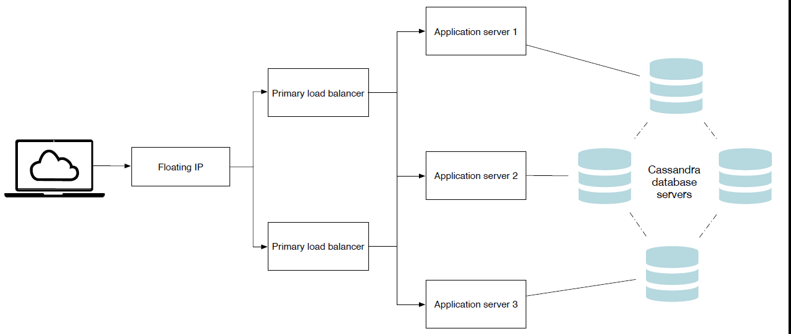
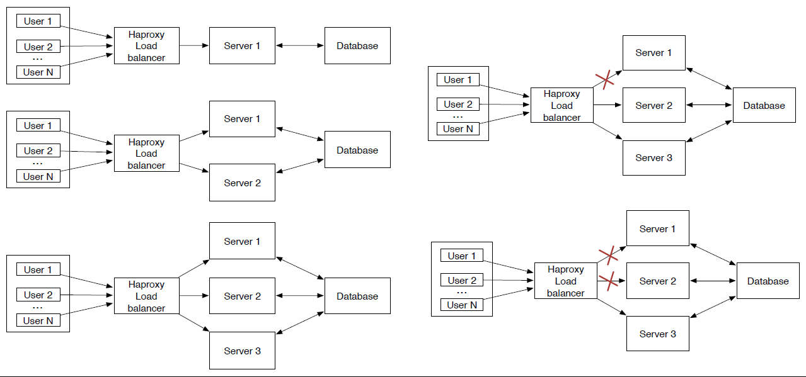
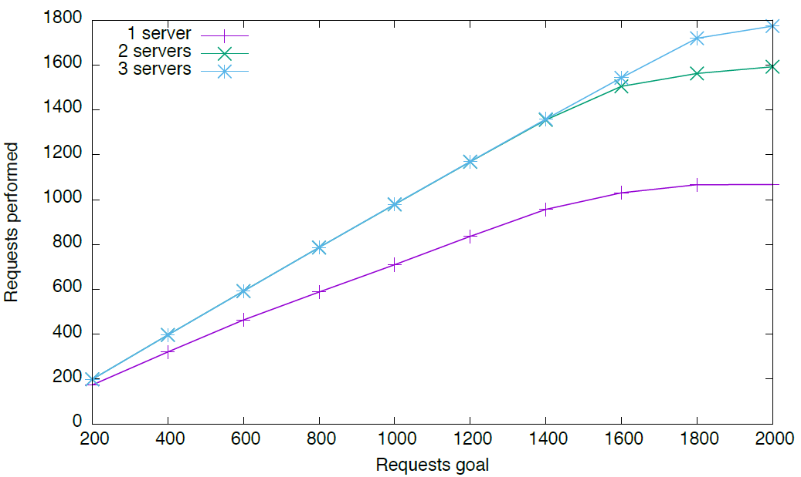
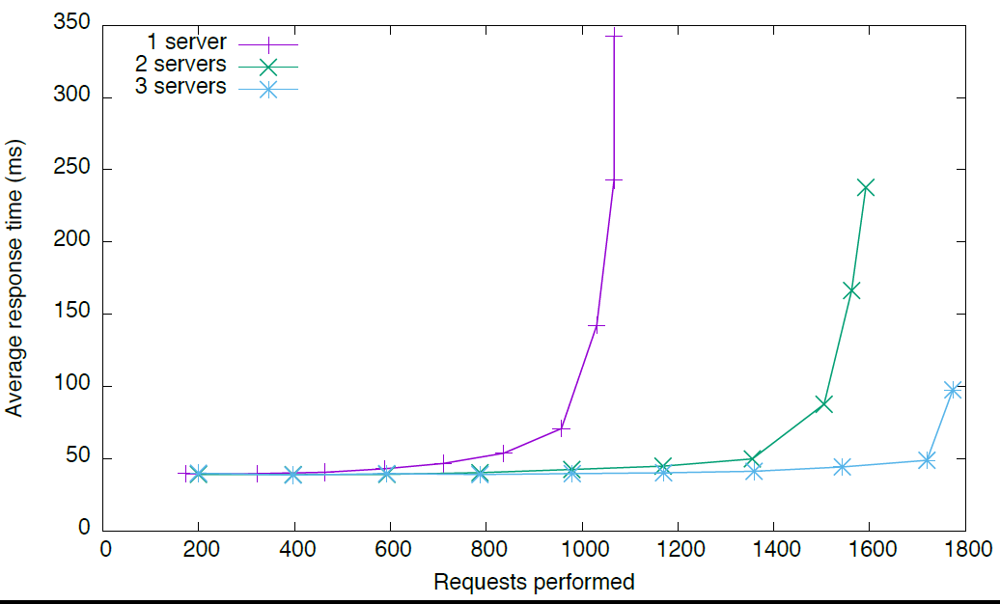
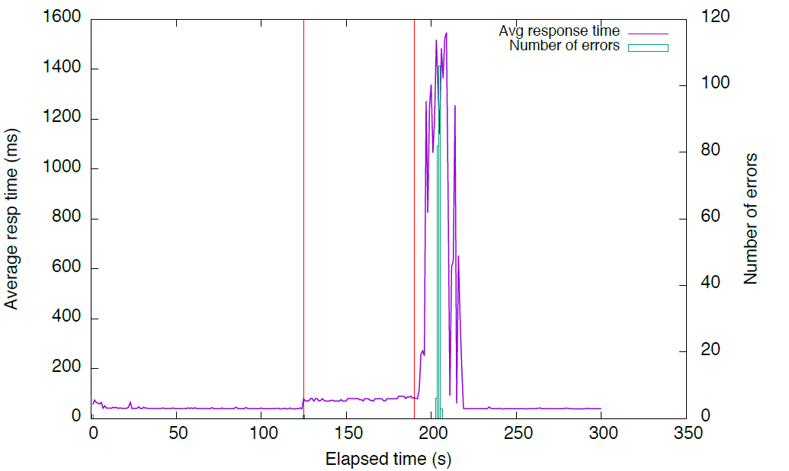
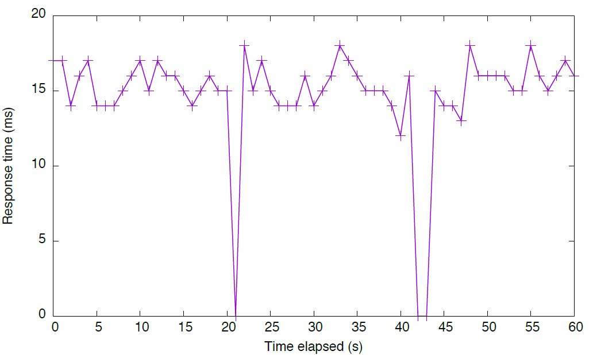

### Component Description
The Domain Registry is the component of reThink’s architecture that together with the Global Registry, forms the Registry Service. The Global Registry provides a mapping from a User’s Unique Id (GUID) to the several services it uses. Each Communication Service Provider (CSP) runs a Domain Registry service that resolves domain-dependent user identifiers to the actual information about this user’s Hyperty Instances (a Hyperty used by a user in one device).

A Domain Registry stores, for each user identifier, the list of Hyperty Instances the user runs on his devices. It also stores, for each Hyperty Instance, the data that enables other applications to contact it, by providing a mapping between the identifier for each Hyperty Instance and the data that characterizes it. It also enables a user's Hyperties to be searched for using several parameters, see [user manual](https://github.com/reTHINK-project/dev-registry-domain/blob/master/docs/DomainRegistryUserManual.md).

The Domain Registry is a critical service as it stands in the critical path for call establishment. As it will be used very often, it must provide a low access time, high availability and be capable of fast updates (e.g. for when a device changes IP address). It is based on the client-server model and handles high-speed and high-frequency data.

### Metrics
Given the Domain Registry requirements presented in the previous section, the following metrics must be evaluated in order to determine the suitability of an implementation:
- Response time for read - As the Domain Registry is a critical component in the call establishment process, the time it takes to perform a read should be small, in the order of the tens of ms. We will test the evolution of this metric as the load on the server increases.
- Number of concurrent requests - A large Service Provider is expected to have a large number of users, which will result in a high number of requests to the Domain Registry. Thus the domain registry should be able to scale to accommodate a large number of requests/s while providing a reasonable response time.
- Response time for write - The device runtime will write to the Domain Registry whenever new Hyperties are deployed, removed or updated. Although not as critical, the response time should also be within tens of ms.
- Error rate - Measured in percentage of the requests that fail to be successfully replied to within the timeout period (defined as 5s). This value should be zero.
- Recovery Time - Measured in second during which the service is not available, after a failure and until the backup server takes over.

This evaluation is presented in two sections. The next section presents the performance evaluation, considering the first 4 metrics. The evaluation of the fail-over mechanisms (fifth metric) is provided in the section after the next one.

### Performance tests
The Domain Registry was evaluated using an HTTP stress tool and a high-availability setup.

#### Evaluation scenario
This section describes the test setup.

##### Domain Registry deployment

The Domain Registry was deployed on [Google Cloud Plataform](https://cloud.google.com/compute/) [St. Ghislain, Belgium](https://cloud.google.com/about/locations/#locations) datacenter, using 8 VM with 1vCPU and 2GB RAM each. The VMs were assigned the roles described in Figure 1: 4 Cassandra DB nodes, 3 application servers and a single load balancer. Figure 1 presents 2 Load Balancers for redundancy purposes, but as a single one is active at any given time, only one was used for these performance tests.
All request are sent to the load balancer, that distributes them in round-robin through the 3 application servers. Application servers query the 4 database servers also using round-robin.

The Operating System used as [Ubuntu 14.04 64bit](http://releases.ubuntu.com/14.04/) and the software was deployed using [Docker](https://www.docker.com/) 1.6.2.
The load balancer uses [haproxy](http://www.haproxy.org/) 1.5.
The [Cassandra DB](http://cassandra.apache.org/) was deployed using version 3.5 with a replication factor of 3.
The application server was deployed using the [Spark micro framework](http://sparkjava.com/) 2.2. The Domain Registry version used was [R 0.2.0](https://github.com/reTHINK-project/dev-registry-domain/releases/tag/R0.2.0).

##### Client tool
The tests were performed using [AutoBench](http://www.xenoclast.org/autobench/) 2.1.1 as a wrapper around [HTTPPerf](http://www.labs.hpe.com/research/linux/httperf/) 0.9.0.
These tools were run on a server with 2 Intel(R) Xeon(R) CPU E5-2640 v2 @ 2.00GHz CPUs (total of 32 cores), 128GB of RAM running Debian 8.2.
This server was located at the University of Lisbon’s, Instituto Superior Técnico's Tagus Park campus, near Lisbon.



#### Test methodology
Two types of tests were performed: performance and scalability tests, where the load is varied; failure recovery testes, where one of 3 servers is failed and then put back online.

The performance and scalability tests were conducted using 1, 2 and 3 application servers (as depicted in the left side of Figure 2). The number of database servers was always 4 in order to maintain the data availability. For each number of servers, 10 httpperf tests were conducted (using autobench) varying the rate from 200 requests/s up to 2.000 request/s with a step of 200 requests/s. Each HTTP connection was used to issue 10 requests (*num_call*) and 2.000 connection (*num_conn*) were used, totalling 20.000 HTTP requests per test point.

The option to have each HTTP connection issue 10 requests was due to the fact that the Domain Registry's client, the Connector running on the Message Node, uses connection pooling and reuse with HTTP persistent connections.

The following autobench command was used for these tests:

```
autobench --single_host --host1 my.server --port1 4567 --uri1 /hyperty/user/userid@inesc-id.pt --low_rate 20 --high_rate 200 --rate_step 20 --num_call 10 --num_conn 2000 --timeout 5
```



The application server failure test was conducted using a scenario with 3 application servers, where one of them was disabled (with a *docker rm -f*) and latter restarted. The goal was to measure the impact of the node leaving (including failure detection) and rejoining the set of nodes used by the haproxy load balancer. This test is depicted in the top right part of Figure 2.

Every test was repeated 50 times. Each data point is the average of all these runs.
The tests are interleaved and were performed over the length of a few days to prevent eventual effects due to time of day network and VMs traffic.

#### Response time

Httperf presents some performance limitation that must be taken into account in order to understand the results obtained. In particular, httperf limits the number of concurrent connections (due to file descriptor limits). If the server is unable to keep up with the request rate, httperf will eventually run out of TCP connections and will be unable to sustain the request rate.
Figure 3 presents the relation between the solicited request rate and the effective request rate. We can see that with 3 servers, httperf is capable of imposing a request rate close to the solicited rate up to 800 req/s. With higher rates, the effective rate falls behind the solicited rate. This effect is more pronounced when using 2 servers. With a single server, we can see that the effective rate lags behind the solicited rate from the very start.



In the following graphs we will use the effective request rate instead of the solicited request rate.

Figure 4 presents the average response rate for an increase request rate.
Considering that the client and server are separated by the Internet, a value below 50 ms was considered acceptable.
We can observe, that as single server can handle up to 700 req/s, while 2 are able to handle almost 1400 req/s and 3 servers are able to handle a little above 1700 req/s.



Going from 1 to 2 servers, we observe an almost linear increase in capacity. However, a third server does not provide the same increase in capacity. This is due to the increased load on the database servers, which will have to be analysed in the future.


### Failure recovery tests

The tests described in the previous Section demonstrate the ability of the Domain Registry implementation to scale in order to handle a large number of clients.
The scalability is provided by the deployment architecture, where the number of nodes processing the requests as well as the number of nodes that make up the database can be dynamically adjusted according to the expected load.
In this Section, we complement the previous scalability evaluation with an evaluation of the high availability performance.

In our deployment architecture, three types of nodes may fail: load balancer, application node or database node. In this section, we examine the impact of failures in the most critical componentes (load balancer and application node). The database server is not evaluated, as it was not designed by us and Cassandra uses a DHT and was designed specifically to handle node failures.

#### Application node failure
The evaluation scenario for this test was the same as used in the previous section.
Figure 5 presents the evolution of the response time and error count in the event of a application server failure. During this test, the effective request rate is constant, at 500 req/s. One of the 3 servers fails at instant 120s and is put back online one minute later. The events are marked in the figure by red vertical lines.



We can observe that the failure of the node results in an increased average response time, as only two servers are left to handle the workload. A small number of failed requests is observer when the server fails. These are the requests being handled by the failed server. Haproxy detects the failure and stops using that server.

When the server is put back online, following a *docker run*, haproxy detects the availability of the servers and adds it to the pool of available servers. However, the server is still booting up the Spark framework. As such, the JVM takes time to do the JIT compilation, load the required classes and open the database connections, leading to a high response time for the first few requests. This impacts the response time and even causes some requests to timeout. After a while, the newly added server recovers and the response time drops to the initial value.


#### Load balancer node failure
The Load Balancer node can also fail. 
We use a master/backup architecture were the master handles all the requests and the backup is on standby to assume the master role when necessary.
In this test, we evaluate the impact on the service of a load balancer failure.

##### Evaluation scenario
These tests were conducted at a later date. As such the scenario is not identical.
The deployment architecture is still the same, as illustrated in Figure 1, but the used testbed was different.
The Domain Registry was deployed on a datacenter at the University of Lisbon’s, Instituto Superior Técnico's Tagus Park campus, using 9 VM with 1vCPU and 2GB RAM each. The VMs were assigned the roles described in Figure 1: 4 Cassandra DB nodes, 3 application servers and a 2 load balancers in active/passive configuration. All requests are sent to the
load balancer, that distributes them in round-robin through the 3 application servers.
The Operating System used was Ubuntu 14.04 64bit and all software was deployed using Docker
1.6.2. The load balancers uses haproxy 1.5. The Cassandra DB was deployed using version 3.5 with a
replication factor of 3. The application server was deployed using the Spark Java framework 2.2. The
Domain Registry version used was R 0.2.0.

The load testing tools were run on a server with 2 Intel(R) Xeon(R) CPU E5-2640 v2 @ 2.00GHz
CPUs (total of 32 cores), 128GB of RAM running Debian 8.2, located in the same datacenter.
After reviewing and testing several open source load testing applications, we ended up choosing [httperf 2](http://www.labs.hpe.com/research/linux/httperf/) to simulate the client load.

##### Test methodology
There are two load balancers. The master node handles all the requests and the backup node is in standby mode.
When the backup node detects a failure of the master, it assumes its role.
This is accomplished by using the Virtual Router Redundancy Protocol (VRRP) running between the two nodes.
A single IP address is shared by both nodes, but only the master announces it.
Under normal conditions, all the requests are sent to the Master.
When the Backup stops receiving VRRP announcements from the Master, it assumes that the Master is down and takes over the shared IP address and operation.
When the Master is back online, the Slave relinquishes control of the shared IP address.
[Keepalived](http://www.keepalived.org/) was used to implement VRRP and the fail-over behaviour.

We simulated two types of Master node failure: failure of the service provided by the node (haproxy) and failure of the fail-over mechanism itself (keepalived). The latter simulates a complete node failure.

##### Recovery Time
Figure 6 illustrates the failure of the service provided by the node.
In this case, after about 20s, we stop the haproxy service on the Master node.
There is a service failure that lasts about 5s. After 5s, the service is resumed by the Backup node.
We set keepalived to monitor Haproxy every 5 seconds. That is why there is a 5 second gap until the Backup node takes over.
However, this value was used just for testing, to actually see the transition. In production this
value will be decreased to 2 seconds. That was the only value that was manually set by us.
At arround 40s, we restart the haproxy service on the Master node.
While assuming the server role, if the Backup node ever starts receiving VRRP advertisements again, it elects the first node as master (because the Master was set up with a higher priority level) and transits back to being the backup node, in a always listening, passive configuration.
The transition back to the Master node is faster. The brief failure in the service is due to the fact that as the IP address changes, ongoing TCP connections are dropped, as these were started with the Backup node but the Master server does not know them, thus rejecting those packets.
All new connections will proceed normally.


Figure 7 shows a similar test, but this time we stop the failover service (keepalived) on the Master node.
Now the service interruption is shorter, as the Backup node stops receiving the VRRP announcements as soon as the keepalived service is stopped.
The return of the control to the Master node is similar to the previous case: when the keepalived service is resumed, it starts sending the VRRP announcements and regains control.



In both situations, the down-time is only a few seconds. This is a reasonable amount of time, particularly when we take into consideration that this is a rare event. The more common failure of an application node is handled by the load balancer (haproxy), as examined in deliverable 6.3.

## Conclusions
Our evaluation allowed us to conclude that the Domain Resgistry is able to handle large loads. Furthermore, its deployment architecture allows us to scale its capacity simply by adding more servers.

The evaluation performed, also demonstrated the ability of the Domain Registry to handle node failures. This is due to its design and implementation, that enables a deployment architecture where all components can be made to be redundant. The Domain Registry was designed and implemented as not to have a single point of failure.
